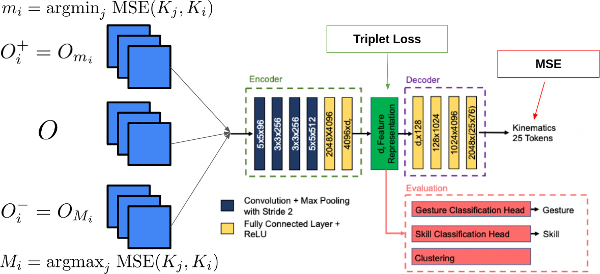

# Multimodal learning
See report.pdf for full project report
Example contrastive model: 

How to use this repository:
1) Extract optical flows from the video
2) Create data blobs
2) Train a model 
3) Evaluate the trained model and get different results including U-map plots, gesture classification, skill classification, task classification

### To install dependencies, please run

<code>pip install sklearn opencv-python tqdm pandas xgboost umap seaborn multipledispatch barbar</code>

### To generate the optical flow, run the following command. You may need to adjust the path for where you downloaded your JIGSAWS directory. This call will perform two steps. The first step will resize the video and the second will generate the optical flow. 

<code>python3 main.py --mode 'optical_flow' --source_directory ../JIGSAWS/Suturing/video/ --resized_video_directory ../JIGSAWS/Suturing/resized_video --destination_directory ../JIGSAWS/Suturing/optical_flow  </code> 

### To generate prepare the data for training, you need to generate 'data_blobs'

<code>python3 main.py --mode 'data_blobs' --optical_flow_path ../JIGSAWS/Suturing/optical_flow --transcriptions_path ../JIGSAWS/Suturing/transcriptions --kinematics_path ../JIGSAWS/Suturing/kinematics/AllGestures --blobs_path ../JIGSAWS/Suturing/blobs</code> 

### To train the network using your data_blobs. Run the following code:  

<code>python3 main.py --mode 'train' --blobs_folder_path '../JIGSAWS/Suturing/blobs' --weights_save_path models</code> 

The paper associated with this repository can be found at https://link.springer.com/article/10.1007/s11548-021-02343-y. The citation details are as follows.

@article{wu2021cross,
  title={Cross-modal self-supervised representation learning for gesture and skill recognition in robotic surgery},
  author={Wu, Jie Ying and Tamhane, Aniruddha and Kazanzides, Peter and Unberath, Mathias},
  journal={International Journal of Computer Assisted Radiology and Surgery},
  volume={16},
  number={5},
  pages={779--787},
  year={2021},
  publisher={Springer}
}

